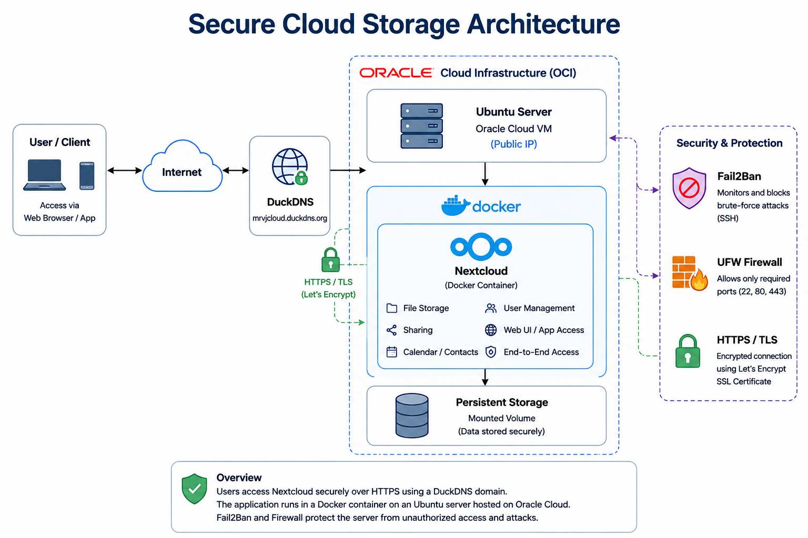
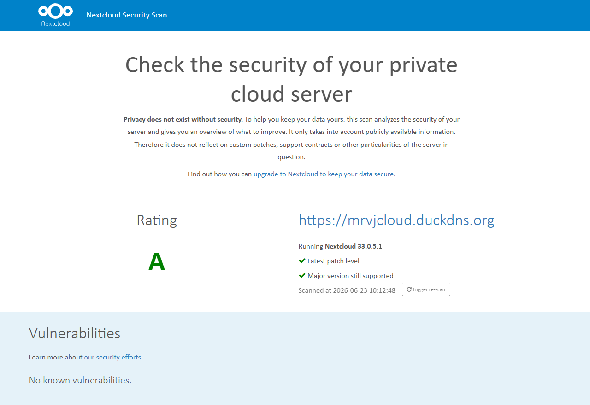
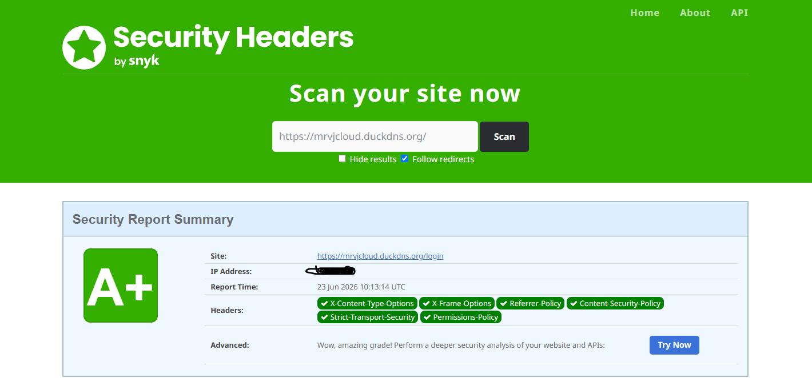
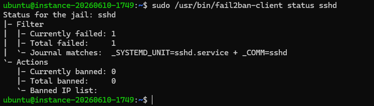
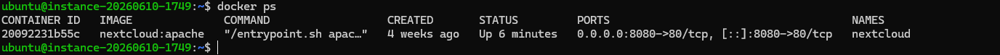

## Secure-cloud-storage

Self-hosted secure cloud storage deployed on Oracle Cloud using Docker and Nextcloud.

## Project Overview

Secure Cloud Storage is a self-hosted cloud storage solution deployed on Oracle Cloud Infrastructure using Docker and Nextcloud. The project demonstrates secure cloud deployment, Linux server administration, containerized applications, HTTPS configuration, intrusion prevention with Fail2Ban, and remote file access. It was built to gain hands-on experience in deploying and securing cloud-hosted services using industry-standard tools and best practices.

## Features

* Self-hosted cloud storage platform
* Docker-based deployment
* Secure HTTPS communication using TLS certificates
* User authentication and access control
* Remote file upload and synchronization
* Persistent data storage
* DuckDNS domain integration
* Fail2Ban protection against brute-force attacks
* Linux server administration
* Oracle Cloud Infrastructure deployment
* Containerized application management

## Technologies Used

- Oracle Cloud Infrastructure (OCI)
- Ubuntu Server
- Docker
- Docker Compose
- Nextcloud
- Fail2ban
- DuckDNS
- Let's Encrypt
- Nginx

## Security Features

* HTTPS/TLS encrypted communication
* SSH key-based server authentication
* Fail2Ban intrusion prevention for SSH and web authentication
* Docker container isolation
* Firewall configuration with restricted network access
* Secure file permissions
* Regular system updates and package maintenance
* Protected remote access using a DuckDNS domain

## Architecture

The project is deployed on an Oracle Cloud virtual machine running Ubuntu Server. Nextcloud is hosted inside a Docker container and is accessible securely through HTTPS using a DuckDNS domain.

## Deployment Process

1. Created a virtual machine on Oracle Cloud Infrastructure.
2. Installed Ubuntu Server.
3. Installed Docker and Docker Compose.
4. Deployed the Nextcloud container.
5. Configured persistent storage for application data.
6. Configured DuckDNS for remote access.
7. Enabled HTTPS for secure communication.
8. Verified external connectivity and file synchronization.

## Project Scope

This project was deployed using the Oracle Cloud Free Tier to demonstrate secure cloud storage deployment and administration. The focus was on implementing core security measures—including HTTPS, Docker containerization, SSH key authentication, Fail2Ban, and multi-factor authentication—while remaining within the resource limits of the free-tier environment.

## Learning Outcomes

This project provided hands-on experience with cloud infrastructure deployment, Linux server management, Docker containerization, secure remote access, HTTPS configuration, DNS management, and storage administration. It also improved my understanding of deploying and maintaining secure services in a cloud environment.

## Security Validation

### Nextcloud Security Scan

### Security Headers

### Fail2Ban

### Docker

## Future Improvements

* Add a honeypot to detect and analyze unauthorized access attempts.
* Integrate an intrusion detection system (IDS) for enhanced monitoring.
* Configure automated encrypted backups
* Add email alerts for security events.
